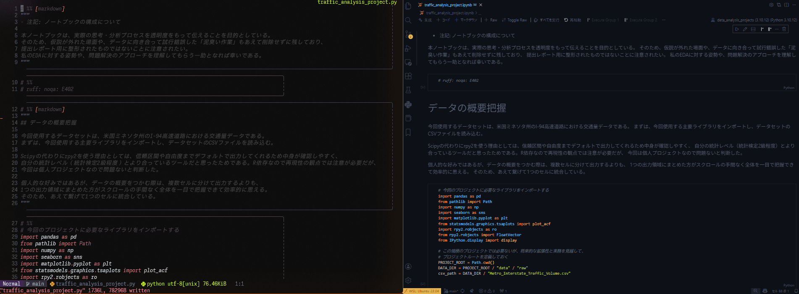

[]()


<p align="right">
  <a href="./README.en.md">English</a>
</p>

# nvim jupy bridge

### 【NeovimとVSCodeを連携し、シームレスなデータサイエンス開発フローを実現】

nvim jupy bridgeは、「Neovimでの快適な編集体験・CLI相性」と「VSCodeのリッチな機能や出力表示」のどちらも妥協できない人のためのJupyter環境を提供する。

#### 主な特徴

- **最小限の依存関係**で
- **両エディタのネイティブ性能**を活かしつつ
- **シームレスに連携**できる

従来のNeovim-Jupyter連携の課題を解消し、機能性と利便性を追求した。

---

### シームレスな連携

nvim jupy bridgeは、NeovimとVSCode間でJupyterノートブックのコードセルをリアルタイムに同期する。Neovimでコードを編集し保存すると、VSCode側で素早く反映され、実行・出力が確認できる。編集されたセルへの視点ジャンプ・フォーカス移動も自動化されており、スムーズな開発フローを実現する。

【視点ジャンプ位置「上寄せ」の例】



<br>

視点ジャンプ位置は、`[extension.js](./extension.js)` にて、
```javascript
nbEditor.revealRange(range, vscode.NotebookEditorRevealType.AtTop);   // ← この部分
```

`AtTop`（上寄せ）  
`InCenter`（中央）  
`AtBottom`（下寄せ）  

のいずれかに変更可能である。

<br>

また、デバッグ用の出力 `NvimJupy Debug` で「Neovimで保存→VSCodeで実行完了」に要した具体的な時間を確認することもできる。


`NvimJupy Debug`の出力は各プロセスにかかった時間も詳細に表示されるため、遅延のボトルネック特定にも役立つ。
例えば、実演映像での３回の実行は、それぞれ約1.8秒弱を要したが、その所要時間の内訳として、

- `jupy_ms` 側の処理に約1200ミリ秒
- `defer_ms` 側の処理に約100ミリ秒
- `TOTAL` 側で処理に約300~500ミリ秒（入力セルの重さ依存）

となっており、`jupy_ms` 側の処理が最も時間を要しており（全体の約7割）、遅延のボトルネックであることが分かる。

各出力ラベルの詳細な説明は、[NvimJupy Debugの見方](docs/NvimJupy_Debug_guide.md) にて解説している。

## 動作原理

この拡張機能のプログラムのざっくりとした流れは以下の通りである。

1. Neovim で `# %%` 付きの `.py` ファイルを保存すると、Lua が Jupytext の同期コマンドを実行する
2. 保存されたファイルのメタ情報を、プロジェクト直下の `.vscode/nvim-sync.json` に書き出す
3. nvim-jupy-bridge 拡張が `nvim-sync.json` を監視し、書き出されたメタ情報を受け取る
4. 拡張側が `.py` 内の `# %%` を上から数え、「カーソルが属する `# %%` ブロックが何番目か」をセル index として `.ipynb` 側のセルにジャンプする。
5. Notebook API 経由で Jupyter カーネルが該当セルを実行する

## 主要コマンド


| コマンド（Neovim側） | アクション（VSCode側） |
| --- | --- |
| `:w` | 保存 + 現セルを実行 |
| `<leader>ra` | セルを全て実行 |
| `<leader>rb` | 現セルより下を全て実行 |


## メリット・デメリット

#### 【メリット】
- **VS Code の Jupyter 機能やその他のリッチな機能をそのまま使える**
- Neovimでの編集は常にプレーンな `.py` なので Gitの差分レビューがしやすい
- Neovim・VS Codeが双方向に同期されるため、どちらのワークスペースからも柔軟に操作可
- ワークスペースが完全に分かれているため、バグやトラブル時に原因を特定しやすい
- CLI ツール・環境との相性が良い
- 視点ジャンプと実行が自動化されるため、操作がシンプルで高速


#### 【デメリット】
- 現時点で同期できるのはjupytext経由での `.py` もしくは `.ipynb` ファイルのみ
- Neovim 単体ですべてを完結させたい場合には向かない
- WSL / CLI / Jupytext / VS Code など、ツールチェーン前提
- `jupy_ms` が遅延のボトルネックとなっている


このあたりをどう評価するかは、普段の開発スタイルや職場の方針によると思われる。個人的に現状のトレードオフに不満はないが、将来的な開発をより快適にするために遅延短縮を検討中である。現時点での遅延時間の改善案としては、[NvimJupy Debugの見方](docs/NvimJupy_Debug_guide.md) にて言及している。

## ディレクトリ構成

```text
nvim-jupy-bridge/
├── README.ja.md
├── README.en.md
├── CHANGELOG.md
├── LICENSE
├── docs/
│   ├── DEV_NOTES.md
│   ├── debug_output.png
│   ├── nvim_jupy_bridge_demo.gif
│   └── NvimJupy_Debug_guide.md
│
├── extension/
│   ├── extension.js
│   ├── package.json
│   ├── package-lock.json
│   └── test/
│       └── extension.test.js
│
├── .vscode/
│   └── extensions.json
│   └── launch.json
│   └── nvim-sync.json
│
├─ vscode-ext/
│  ├──.vscodeignore
│  └──.vscode-test.mjs
│
├── nvim/
│   └── nvim-jupy-bridge.lua
│
├── eslint.config.mjs
├── jsconfig.json
└── .gitignore
```

## 動作環境と最小セットアップ手順

※ 個人利用を想定した拡張機能であるため、
Marketplaceでの公開やluaスクリプトのモジュール化は現時点で未実装である点はご了承いただきたい。

---

### 動作確認済み環境


| 項目 | 内容 |
|---|---|
| OS | Windows 11 + WSL2 Ubuntu 22.04 |
| エディタ | Neovim v0.11.4 |
| 実行・UI | VS Code 1.107.1 (Remote - WSL) |
| 同期 | Jupytext 1.18.1（CLI） |
| 橋渡し | nvim-jupy-bridge v0.0.9 |


> Neovimで Jupytextでペアリングされた .py を編集し、VS Codeで 対応する .ipynb を実行する運用を前提

---

### セットアップ （3ステップ）

1. jupytext のインストール  
   ```bash
   pip install jupytext
   ```

2. VS Code 側で本拡張機能をインストール・有効化する  
   - Assets から [vsixパッケージ](https://github.com/Yuji-RE/nvim-jupy-bridge/releases/tag/v0.0.9) をダウンロードし、VS Code のコマンドパレットから `Extensions: Install from VSIX...` を実行してインストールする

3. Neovim 側で `nvim-jupy-bridge.lua` を読み込む
    - Neovim 側で [`nvim-jupy-bridge.lua`](nvim/nvim-jupy-bridge.lua) を読み込む（init.lua などでそのままコピペ可能）

---

### 使い方

1. 同期された`.py` と `.ipynb` ファイルを用意する;
    - VS Codeで `.ipynb` もしくは `.py` を右クリックし、「Jupytext: Pair Notebook with percent script」を選択して、対応ファイルをファイルを生成する
    【代替案】
    - Neovim / Terminal で以下のコマンドを実行して、対応ファイルを生成する
    ```bash
    jupytext --set-formats ipynb,py:percent your_notebook.ipynb
    ```

2.  VS Codeで `.ipynb`を、Neovimで `.py` ファイルを開く（推奨: 画面分割 or デュアルモニター表示）

3.  Neovimで `#%%`形式でpyスクリプトを編集し、任意の行で [コマンド](https://github.com/Yuji-RE/nvim-jupy-bridge#%E4%B8%BB%E8%A6%81%E3%82%B3%E3%83%9E%E3%83%B3%E3%83%89) を実行する。

4.  VS Code側で以下の処理が自動的に行われる;
    *   自動的に保存される。
    *   VS Codeが自動的にスクロールし、該当するセルを実行する。

→ 結果、Neovimから手を離さずに、グラフや計算結果を確認可能

---

> [!NOTE]
> 環境によっては、`.py` と `.ipynb` の同期は成功しても、NotebookのUIが反映されない場合がある。
> その際は、VSCodeのユーザー設定で以下のオプションを有効化すると問題が解消される場合がある。

```json
  "jupytext.syncOnSave": true,             // 保存時に同期
  "jupytext.watchFiles": true,            // 外部変更を監視してノートブックに反映
  "jupyter.alwaysTrustNotebooks": true,  // 毎回の安全確認を省く（任意）
  "files.autoSave": "afterDelay",       // watchFilesと組み合わせて、UI更新を促進
  "files.autoSaveDelay": 2000,         // 遅延時間は環境に応じて調整
```

NotebookのUIが反映されないのは、Notebook UI の in memory が外部変更よりも優先されるためだと疑われる。
実際に、そのような状況でVSCodeで `revert` コマンドを実行すると、UIが反映されることが確認できる。
上記のユーザー設定は、毎回の `revert` による手動操作を省くための対策である。

---

### 依存関係の詳細

<br>

セットアップ手順は上記の内容で十分な場合が多いと思われるが、
参考程度に、以下に詳細な依存関係をまとめておく。

#### 依存関係（ユーザーが利用するのに必要）

| 区分 | 依存 | 必須 | 役割 / 備考 |
|---|---|---:|---|
| Editor | Neovim | ✅ | `.py` を編集し、同期トリガ情報を `.vscode/nvim-sync.json` に出す（Lua設定） |
| Sync | Jupytext（CLI / Pythonパッケージ） | ✅ | `.py` ⇄ `.ipynb` のペア運用（同期） |
| Viewer/Runner | VS Code | ✅ | Notebook UI の表示・操作 |
| VS Code拡張 | nvim-jupy-bridge（VSIX） | ✅ | `nvim-sync.json` の更新を拾い、セル特定→Notebook操作→実行を行う |
| VS Code拡張 | Jupyter 拡張（ms-toolsai.jupyter） | ✅ | ノートブック実行コマンド/APIの提供（内部でPython/Jupyter環境が必要） |
| VS Code拡張 | Python 拡張（ms-python.python） | ✅（実質） | Python環境の検出・選択にほぼ必須（Jupyter運用の前提になりがち） |
| Kernel | ipykernel（Pythonノートの場合） | ✅（Python時） | Pythonカーネル。ノートブック実行の実体 |
| Python | Python 3.x | ✅（Python時） | Jupytext と Jupyter カーネル（ipykernel）を動かす実行環境 |
| Remote | Remote - WSL（WSLで開く場合） | ✅（WSL運用時） | VS Code から WSL 内のプロジェクトを扱うため |
| Notebook | `.ipynb`（対応するノート） | ✅ | 実行対象。`.py` とペアで運用される前提 |


#### 依存関係（拡張の開発・ビルドに必要）

| 区分 | 依存 | 必須 | 役割 / 備考 |
|---|---|---:|---|
| Node | Node.js + npm | ✅ | VS Code拡張を開発・パッケージするため（実行時はVS Code内のNodeで動く） |
| Packaging | vsce（または @vscode/vsce） | ✅ | `.vsix` を作る（配布用パッケージング） |
| Git | git | 任意 | 開発運用（バージョン管理） |


---

### ⚠️免責事項

本拡張機能は、筆者が初学者なりに要件定義・挙動の検証・デバッグを行い、実装面(コーディング等)ではAIツールのアシストを大きく活用して開発したものである。再利用をご検討の場合は、本拡張が個人での利用を想定して作成した実験段階のものであり、他環境での動作再現性および安全性は未検証である旨にご留意いただきたい。

また、少しでもこのプロジェクトの透明性を高めるため、開発過程の試行錯誤をドキュメントを[DEV_NOTES.md](./docs/DEV_NOTES.md)にまとめている。
より個人的な視点からの開発背景をまとめた[Zenn記事](https://github.com/Yuji-RE/Zenn_BLOG/blob/main/articles/Inprogress.md)（執筆途中）もあるため、興味があれば参照いただきたい。
