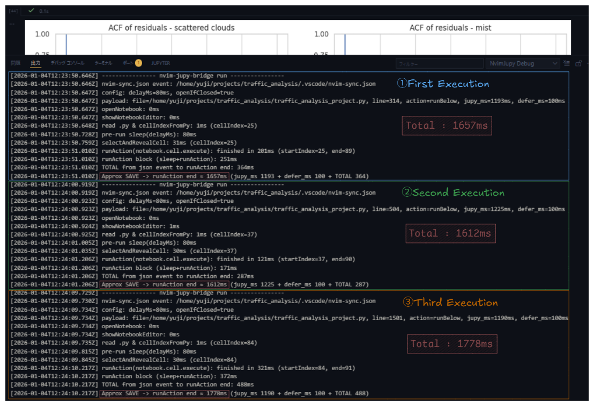

## NvimJupy Debug ガイド




# 出力項目一覧

このログは「Neovimで保存 → nvim-sync.json更新 → VS Code拡張が検知 → 対象セル特定 → Notebook UI操作 → Jupyter実行」
という一連の流れを、区間ごとに計測して出力したものである。

## 1) ヘッダ（1回の実行の開始）

| ログ出力 | 意味 | 所属 |
|---|---|---|
| `---------------- nvim-jupy-bridge run ----------------` | 1回分の実行ログの開始を示す区切り線 | - |

---

## 2) イベント検知 / 設定 / 入力ペイロード

| ログ出力 | 意味 | 備考 | 所属 |
|---|---|---|---|
| `nvim-sync.json event: <path>` | `.vscode/nvim-sync.json` の更新を拡張が検知 | ここが VS Code側の計測開始点に近い | VS Code拡張 |
| `config: delayMs=80ms, openIfClosed=true` | 拡張の実行前設定 | `delayMs` は固定待機、`openIfClosed` はNotebookが閉じてたら開く | VS Code拡張 |
| `payload: file=..., line=..., action=..., jupy_ms=..., defer_ms=...` | Neovim → VS Code に渡された指示（実行対象など） | `jupy_ms` / `defer_ms` は **Neovim側で計測**された値を“参考情報として”載せている | mixed（値はNeovim側） |

### payload 内フィールド（詳細）

| フィールド | 意味 | 所属 |
|---|---|---|
| `file` | 対象の `.py` パス | Neovim |
| `line` | Neovim のカーソル行（実行されるセルに対応する行） | Neovim |
| `action=runBelow` | “このセルから下を実行” | Neovim |
| `action=runAll` | “全セルを実行” | Neovim |
| `jupy_ms` | 保存直後の **Jupytext同期が落ち着くまで**（Neovim側の計測値） | Neovim |
| `defer_ms` | `nvim-sync.json` 書き込み等の **追加ディレイ**（Neovim側の計測値） | Neovim |

---

## 3) Notebook UI 操作（開く / 表示 / セル特定）

| ログ出力 | 意味 | 備考 | 所属 |
|---|---|---|---|
| `openNotebook: Xms` | Notebook を開く処理 | `0ms` なら「すでに開いていた」ケースが多い | VS Code拡張 |
| `showNotebookEditor: Xms` | Notebook Editor を前面に出す／表示する処理 | `0ms` なら「すでに表示されていた」ことが多い | VS Code拡張 |
| `read .py & cellIndexFromPy: Xms (cellIndex=N)` | `.py` を読んで、`line` が属するセル番号 `cellIndex` を求めた | Jupytext形式（例：`# %%`）を解釈してセル境界を決める | VS Code拡張 |

---

## 4) 実行前待機 → セル選択 → 実行本体

| ログ出力 | 意味 | 備考 | 所属 |
|---|---|---|---|
| `pre-run sleep(delayMs): Xms` | 実行直前の固定待機 | `delayMs` に一致しやすい（ほぼ固定） | VS Code拡張 |
| `selectAndRevealCell: Xms (cellIndex=N)` | 対象セルを選択し、画面上に見える位置へスクロール | UI操作の体感に影響しやすい区間 | VS Code拡張 |
| `runAction(notebook.cell.execute): finished in Xms (startIndex=A, end=B)` | `runBelow` の実行本体（セル範囲実行） | `A..B` は実行したセル範囲 | VS Code拡張＋Jupyter |
| `runAction(notebook.execute): finished in Xms` | `runAll` の実行本体（全セル実行） | `runAll` のときはこちら | VS Code拡張＋Jupyter |

> `runAction(...)` の中身は **「VS Codeの実行」＋「Jupyter側の実行」**が混ざるため、セル内容（重さ）に強く依存する
>（＝ 拡張自体の遅延との関係は薄い）

---

## 5) 集計値

| ログ出力 | 何を合算しているか | 意味 | 所属 |
|---|---|---|---|
| `runAction block (sleep+runAction): Xms` | `pre-run sleep` + `runAction` | `delayMs` の影響込みで、拡張が「実行」に費やした総時間感 | VS Code拡張 |
| `TOTAL from json event to runAction end: Xms` | **jsonイベント検知〜実行終了まで**（拡張側の全処理） | **“VS Code拡張側だけの遅さ”**を見る基本指標（Neovim側は除外） | VS Code拡張 |
| `Approx SAVE -> runAction end ≈ ... (jupy_ms ... + defer_ms ... + TOTAL ...)` | `jupy_ms + defer_ms + TOTAL` | 保存→実行完了の **体感レイテンシ概算**（全体） | mixed（合算） |

---

### 読み方（最小）

- **体感遅延**を見る → `Approx SAVE -> runAction end`
- **VS Code拡張側だけ**を見る → `TOTAL from json event to runAction end`
- **Neovim側が食ってる分**を見る → `jupy_ms` と `defer_ms`
- **実行セルが重いか**を見る → `runAction(...): finished in ...`


---

#### 遅延のトラブルシューティングの一例

例えば、`jupy_ms`が不自然に大きい場合、以下が基本的な確認事項となる：

1. 「jupytext 自体が遅いかどうか」の確認
```bash
time jupytext --sync path/to/notebook.py
```

2. 環境の整合性確認
```bash
top -o %CPU
uptime
```

3. CPU負荷の高いプロセスが走っていないか確認
```bash
uptime
top -o %CPU
```

5. I/O負荷の確認
```bash
iostat -xz 1 5
```

6. ノートブックのサイズ確認
```bash
ls -lh euro_rates_story.ipynb euro_rates_story.py
```

7. import 時間の確認
```bash
time python -c "import jupytext"
```

8. 再ベンチマーク確認
```bash
time jupytext --sync path/to/notebook.py
```

これらの結果から、必要な措置（PCの再起動、不要プロセスの停止、ストレージの見直し、ノートブック分割など）を検討すると良い。

---

#### 補足: `jupy_ms` のボトルネックについての展望

冒頭の画像の例からも分かる通り、nvim jupy bridgeでは`jupy_ms`が全体（約1.7秒）の約7割を占めており、**遅延のボトルネック**となっている。

`jupy_ms`は「Neovimで保存 → jupytext同期が完了してipynbが更新されるまで」の時間なので、

中身はざっくり：

- 外部プロセス起動コスト
jupytext をCLIで叩いてるから、**毎回** Python起動 + import が走る
→ これだけで普通に 200〜600ms かかることがある

- I/O（読み書き）
.py と .ipynb 読む、パースする、.ipynb を書き直す
→ ファイルサイズ/セル数/ストレージ/WSL越し/アンチウイルス等で所要時間がかさむ

これに加え、同期コマンド`--sync`は「ペアを見て差分反映」なので、軽くはない（完全に差分更新だけって感じでもない）ので、1秒前後〜1.5秒程度の時間がかかるのは自然の範疇だと考えられる。

つまり、**CLIを毎回起動する**今のアプローチの限界に起因するボトルネックであり、
この問題を解決するには根本的なアプローチ変更が必要になる可能性が高い。
また、CLI起動の速度はCPU依存の場合もあるため、マシンスペックによっては更に悪化する可能性もある。

具体的に取れうる手段としては様々あるが、
実装コスト・パフォーマンス安定性・自身のITスキルの観点から、以下の案を将来的な改善案として検討中である；

Pythonを**毎回起動せず**（persistent化）、
- jupytext を **常駐プロセス（daemon）**として立ち上げて
- Neovim側からソケット/stdin経由で「ファイル同期コマンド」をたたく

このアプローチであれば、「起動コスト」が消え`jupy_ms`が数百msレベルまで落ちる可能性があるので、
DSプロジェクトが高度化して遅延が気になるようになった場合に備え、将来的に検討していきたい。
